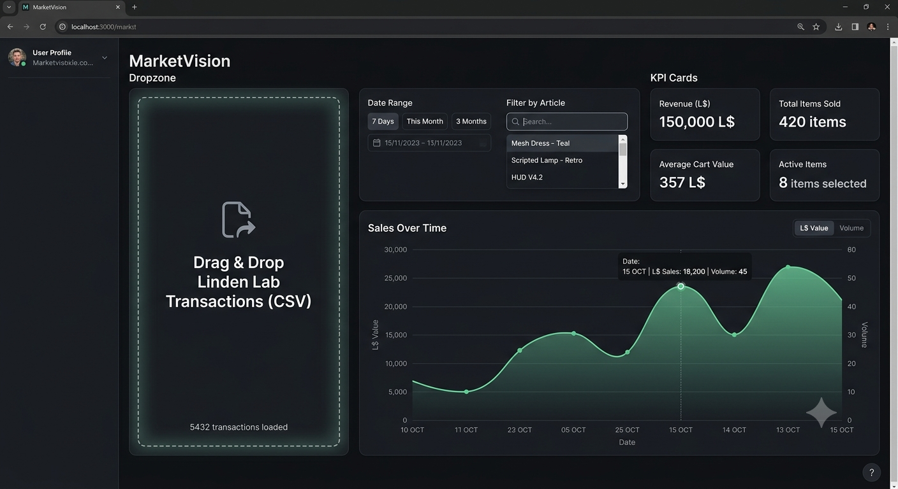

# SL Marketplace Vision

A browser-based dashboard for visualizing your Second Life Marketplace sales history. Drop your CSV exports, explore revenue trends, and identify your top-selling products — all locally, with no account or server required.



---

## Getting started

### Running locally

```bash
npm install
npm run dev
```

Then open [http://localhost:5173](http://localhost:5173) in your browser.

### Importing your sales data

1. Go to your Second Life Marketplace seller dashboard and export your transaction history as a CSV file.
2. Drag and drop the file onto the **Drag & Drop** zone on the left, or click it to open a file picker.
3. The app validates the file format and imports all **Delivered** transactions. Free items (L$0) are counted in volume but excluded from revenue.
4. You can import multiple files — duplicate orders are automatically ignored.

Your data is stored locally in your browser (IndexedDB). Nothing is sent to any server.

---

## Interface

### Controls

- **Date Range** — Pick a start and end date to focus on a specific period. Four quick selectors are available:
  - **All** — no date filter, show everything
  - **Last Year** — rolling 12 months up to today
  - **Y-1** — the 12-month period before Last Year (useful for year-over-year comparison)
  - **Last Month** — rolling 30 days up to today
- **Filter by Product** — Multi-select dropdown to show only specific products. The **ALL** toggle resets the selection.

### KPI Cards

Three summary figures, always reflecting the current filters:

| Card | Meaning |
|---|---|
| **Revenue (L$)** | Total income from paid transactions |
| **Net Amount (L$)** | Revenue after Linden Lab commissions |
| **Total Sales** | Number of transactions (including free items) |

### Charts

Two views, switchable via the tabs at the top of the chart area. The **Revenue L$ / Volume** toggle on the right changes what the Y-axis or bar length represents.

**Sales Over Time** — Smoothed area chart showing revenue or volume over time. The time axis groups by day when the selected range is 90 days or less, and by month for longer ranges.

**Top Articles** — Horizontal bar chart ranking your products by revenue or volume (descending). Scroll within the list if you have many products.

### Preferences

Click the **gear icon** at the bottom of the Controls panel to open Preferences. From there you can **Reset Data**, which permanently clears all imported transactions from your browser storage.

---

## Notes

- All data stays in your browser. Clearing browser storage or using a different browser will lose your data.
- The app accepts the standard Linden Lab CSV export format. Column order must be the standard one — column headers are ignored, so any language works.
- Only transactions with status `Delivered` are imported. Cancelled or pending orders are skipped.
